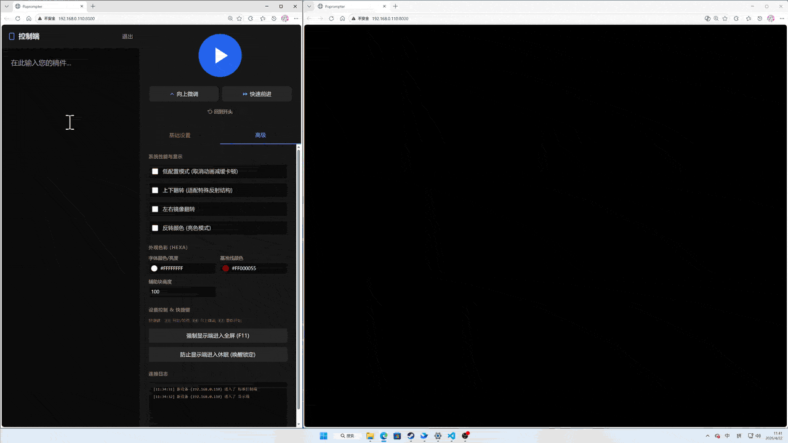

# Poprompter

<p align="center">
  
</p>

使用 Python 基于 FastAPI + WebSocket + React 的多设备协同提词器系统，支持网络跨设备实时同步。

## 功能特性

- **多角色协同** — 控制端、纯净遥控器、提词器屏幕三端分离
- **实时同步** — 基于 WebSocket 的毫秒级状态同步
- **纯文本遥控** — 独立的 `/k` 路径，AJAX 轮询模式，兼容 Kindle iPhone 4/5 等老旧设备
- **丰富调控** — 滚动速度、字号、画面占比、镜像翻转、颜色反转等
- **段落字号** — 使用 `&size:数字&` 语法为不同段落指定独立字号(未完善)
- **辅助线/块** — 可自定义颜色的基准线和半透明辅助块
- **快捷键** — F3 播放/暂停、F4 向上微调、F7 回到开头
- **全屏控制** — 远程强制显示端进入全屏
- **防休眠** — Wake Lock API 防止显示端息屏
- **离线运行** — 前端库自动下载到本地，运行时无需联网
- **MCU 遥控** — 支持 ESP32 等 MicroPython 设备作为硬件遥控器

## 项目结构

```
Poprompter/
├── teleprompter_server.py       # 服务器入口
├── config.ini                   # 配置文件 (端口、CDN 来源等)
├── templates/
│   ├── index.html               # 主页面 (角色选择 / 控制端 / 显示端)
│   └── pure.html                # 纯净控制器页面 (无框架，兼容老设备)
└── static/
    ├── vendor/                  # 自动下载的前端库 (无需手动管理)
    ├── css/
    │   ├── main.css             # 主页自定义样式
    │   └── pure.css             # 纯净控制器样式 (含黑白主题)
    └── js/
        ├── app.js               # React 主应用 (Babel 编译)
        └── pure.js              # 纯净控制器逻辑 (AJAX 轮询)
```

## 快速开始

### 第一步：安装 Python

Poprompter 需要 Python 3.9 或更高版本。

#### Windows

1. 前往 [python.org/downloads](https://www.python.org/downloads/) 下载最新版 Python
2. 运行安装程序，**务必勾选底部「Add Python to PATH」**，然后点击 Install Now
3. 安装完成后验证：按 `Win + R`，输入 `cmd`，回车打开命令提示符，输入：
   ```
   python --version
   ```
   显示版本号即安装成功

#### macOS

**方式 A — 官方安装包：**
1. 前往 [python.org/downloads](https://www.python.org/downloads/) 下载 macOS 安装包
2. 运行 `.pkg` 安装程序，按提示完成安装

**方式 B — Homebrew（推荐）：**
1. 打开「终端」（在 Launchpad > 其他 中，或 Spotlight 搜索 Terminal）
2. 安装 Homebrew（如未安装）：
   ```bash
   /bin/bash -c "$(curl -fsSL https://raw.githubusercontent.com/Homebrew/install/HEAD/install.sh)"
   ```
3. 安装 Python：
   ```bash
   brew install python
   ```
4. 验证：
   ```bash
   python3 --version
   ```

#### Linux (Ubuntu / Debian)

打开终端（`Ctrl + Alt + T`），执行：

```bash
sudo apt update
sudo apt install python3 python3-pip
python3 --version
```

---

### 第二步：打开终端（命令行）

| 系统 | 操作 |
|------|------|
| **Windows** | 按 `Win + R`，输入 `cmd`，回车。或在文件夹地址栏输入 `cmd` 回车 |
| **macOS** | 按 `Cmd + 空格`，输入 `Terminal`，回车 |
| **Linux** | 按 `Ctrl + Alt + T`，或应用菜单中找到「终端」 |

---

### 第三步：下载项目并安装依赖

将项目下载/解压到你喜欢的位置，然后在终端中进入项目目录：

```bash
cd /path/to/Poprompter
```

安装 Python 依赖：

```bash
pip install fastapi uvicorn websockets
```

> macOS / Linux 用户如提示 `pip` 不存在，请使用 `pip3`：
> ```bash
> pip3 install fastapi uvicorn websockets
> ```

---

### 第四步：启动服务器

```bash
python teleprompter_server.py
```

> macOS / Linux 用户：
> ```bash
> python3 teleprompter_server.py
> ```

首次启动会自动下载前端库到 `static/vendor/`（需联网），下载完成后自动打开浏览器。

---

### 第五步：使用

| 页面 | 路径 | 说明 |
|------|------|------|
| 角色选择 | `/` | 默认首页，选择进入哪种角色 |
| 标准控制端 | `/s` | 完整控制面板（编辑文本 + 所有参数调节） |
| 显示屏幕 | `/d` | 提词器滚动显示画面 |
| 纯净遥控器 | `/k` | 极简遥控，兼容老设备/Kindle |

在同一局域网内，用不同设备的浏览器打开控制台显示的地址即可协同使用。

## 配置文件 (config.ini)

首次运行会自动生成 `config.ini`，内容如下：

```ini
[server]
port = 8000
host = 0.0.0.0
auto_open_browser = true

[cdn]
source = 1
force_download = false
```

### [server] 服务器设置

| 字段 | 默认值 | 说明 |
|------|--------|------|
| `port` | `8000` | 服务监听端口 |
| `host` | `0.0.0.0` | 监听地址，`0.0.0.0` 允许局域网访问 |
| `auto_open_browser` | `true` | 启动后是否自动打开浏览器 |

### [cdn] 前端库下载设置

| 字段 | 默认值 | 说明 |
|------|--------|------|
| `source` | `1` | CDN 来源编号（见下表） |
| `force_download` | `false` | 是否每次启动都重新下载 |

**CDN 来源选项：**

| 编号 | CDN | 说明 |
|------|-----|------|
| `1` | unpkg / cdn.tailwindcss.com | 推荐，完整 Tailwind JIT 支持（支持任意值 `w-[123px]`） |
| `2` | BootCDN (cdn.bootcdn.net) | 国内加速，预编译 CSS，不支持 JIT 任意值 |
| `3` | 字节跳动 Staticfile (cdn.staticfile.net) | 国内加速，预编译 CSS，不支持 JIT 任意值 |

> 国内用户如果默认源下载慢，可将 `source` 改为 `2` 或 `3`，但部分高级 Tailwind 语法不可用，其中 babel.js 过大，可能需要下载一定时间。

## 快捷键

| 按键 | 功能 |
|------|------|
| F3 | 播放 / 暂停 |
| F4 | 向上微调 |
| F7 | 回到开头 |

快捷键在控制端和纯净遥控器中均可用。

## API 接口

| 方法 | 路径 | 说明 |
|------|------|------|
| GET | `/api/state` | 获取当前状态 |
| POST | `/api/command` | 发送指令 `{action: "SCROLL_UP"}` |
| POST | `/api/update_state` | 更新状态（合并到当前状态） |
| GET | `/api/trigger/{action}` | 触发动作 (toggle/play/pause/up/forward/reset) |
| WS | `/ws` | WebSocket 实时双向通信 |

## 段落字号语法**(未完善)**

在文本中使用 `&size:数字&` 可为后续段落指定独立字号：

```
&size:80&这段文字字号为 80px
&size:50&这段文字字号为 50px
&size:100&这段文字字号为 100px
没有标记的段落使用默认字号
```

## MCU 硬件遥控器 (ESP32 + MicroPython)

你可以用 ESP32 等 MCU 制作一个实体硬件遥控器，通过 WiFi 连接 Poprompter 服务器发送控制指令。

### 接线示例

```
ESP32 开发板
├── GPIO 0  (BOOT 按钮) ── 播放 / 暂停
├── GPIO 35 (ADC)       ── 向上微调 (接按钮到 GND)
├── GPIO 32 (ADC)       ── 快速前进 (接按钮到 GND)
└── GPIO 33 (ADC)       ── 回到开头 (接按钮到 GND)
```

> 也可以只使用 ESP32 开发板上自带的 BOOT 按钮 (GPIO 0)，实现最简遥控。

### MicroPython 代码

将以下代码保存为 `main.py` 上传到 ESP32：

```python
import network
import urequests
import machine
import time

# ========== 配置区 ==========
WIFI_SSID = "你的WiFi名称"
WIFI_PASS = "你的WiFi密码"
SERVER_IP = "192.168.1.100"   # Poprompter 服务器 IP
SERVER_PORT = 8000            # Poprompter 服务器端口
# ============================

def connect_wifi():
    wlan = network.WLAN(network.STA_IF)
    wlan.active(True)
    if not wlan.isconnected():
        print("正在连接 WiFi...")
        wlan.connect(WIFI_SSID, WIFI_PASS)
        while not wlan.isconnected():
            time.sleep(0.5)
    print("WiFi 已连接:", wlan.ifconfig()[0])

def send_trigger(action):
    url = f"http://{SERVER_IP}:{SERVER_PORT}/api/trigger/{action}"
    try:
        res = urequests.get(url)
        res.close()
        print(f"指令已发送: {action}")
    except Exception as e:
        print(f"发送失败: {e}")

def send_command(action):
    url = f"http://{SERVER_IP}:{SERVER_PORT}/api/command"
    try:
        urequests.post(url, json={"action": action})
        print(f"命令已发送: {action}")
    except Exception as e:
        print(f"发送失败: {e}")

# 按钮防抖
class Button:
    def __init__(self, pin_num, callback, pull=machine.Pin.PULL_UP):
        self.pin = machine.Pin(pin_num, machine.Pin.IN, pull)
        self.callback = callback
        self._last = 0
        self.pin.irq(trigger=machine.Pin.IRQ_FALLING, handler=self._handler)

    def _handler(self, pin):
        now = time.ticks_ms()
        if time.ticks_diff(now, self._last) > 300:
            self._last = now
            self.callback()

connect_wifi()

# GPIO 0 — 板载 BOOT 按钮: 播放/暂停
Button(0, lambda: send_trigger("toggle"))

# 以下为可选扩展按钮 (接对应 GPIO 到 GND 即可)
# Button(35, lambda: send_command("SCROLL_UP"))
# Button(32, lambda: send_command("FAST_FORWARD"))
# Button(33, lambda: send_trigger("reset"))

print("Poprompter 遥控器已就绪")
```

### 使用方法

1. 使用 [Thonny](https://thonny.org/) 或 `ampy` 将代码上传到 ESP32 的 `main.py`
2. 修改代码顶部的 WiFi 名称、密码和服务器 IP
3. ESP32 上电后自动连接 WiFi，按 BOOT 按钮即可切换播放/暂停
4. 如需更多按钮，取消注释并接线即可

### 可用指令速查

| 触发器动作 | 说明 | 调用方式 |
|-----------|------|---------|
| `toggle` | 播放/暂停 | `send_trigger("toggle")` |
| `play` | 强制播放 | `send_trigger("play")` |
| `pause` | 强制暂停 | `send_trigger("pause")` |
| `reset` | 回到开头并暂停 | `send_trigger("reset")` |
| `SCROLL_UP` | 向上微调 | `send_command("SCROLL_UP")` |
| `FAST_FORWARD` | 快速前进 | `send_command("FAST_FORWARD")` |
| `FULLSCREEN` | 显示端全屏 | `send_command("FULLSCREEN")` |
| `WAKE_LOCK` | 防止显示端休眠 | `send_command("WAKE_LOCK")` |

## 系统要求

- Python 3.9+
- 现代浏览器（Chrome / Firefox / Edge / Safari）
- 纯净遥控器兼容极老浏览器（Kindle Silk 等）
- 首次启动需要网络连接（下载前端库），之后完全离线
- MCU 遥控器需要 ESP32 + MicroPython 固件（可选）
